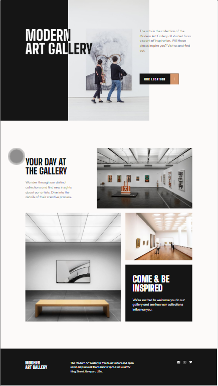

# Art gallery website solution

## Table of contents

- [Overview](#overview)
  - [The challenge](#the-challenge)
  - [Screenshot](#screenshot)
  - [Links](#links)
- [My process](#my-process)
  - [Built with](#built-with)
  - [What I learned](#what-i-learned)

## Overview

This is the first multipage site that I have done on Frontend mentor. This is also the first time that I have used an API in one of my projects. I thought that the website itself wasn't very challenging. However, the API was a bit of a challenge for me. Any feedback would be greatly appreciated.

- Would it be better to combine my CSS for both pages into one file?
- I put my button inside of a form. Is this the correct way to do it?
- Any opinions on my grid?
- I used span to break the headings to match the design. Is this the correct way of doing it?
- How's my JS? Especially the map implementation?
### The challenge

Users should be able to:

- View the optimal layout for each page depending on their device's screen size
- See hover states for all interactive elements throughout the site
- **Bonus**: Use [Leaflet JS](https://leafletjs.com/) to create an interactive location map with custom location pin

### Screenshot

### Links

- Solution URL: [https://github.com/arfarobs/art-gallery-website](https://github.com/arfarobs/art-gallery-website)
- Live Site URL: [https://arfarobs.github.io/art-gallery-website/](https://arfarobs.github.io/art-gallery-website/)

## My process

1. Write the index page's HTML.
2. Style the index page's mobile view.
3. Style the index page's tablet view.
4. Style the index page's desktop view.
5. Write the location page's HTML.
6. Style the location page's mobile view.
7. Style the location page's tablet view.
8. Style the location page's desktop view.
9. Style the active states with CSS and JS.
10. Implement the leaflet map.
11. Write the readme.

### Built with

- Semantic HTML5 markup
- CSS
- Flexbox
- CSS Grid
- Mobile-first workflow
- Leaflet.js
- Mapbox API

### What I learned

I learned how to use linear gradient on text.

I learned about the picture tag and srcset.

